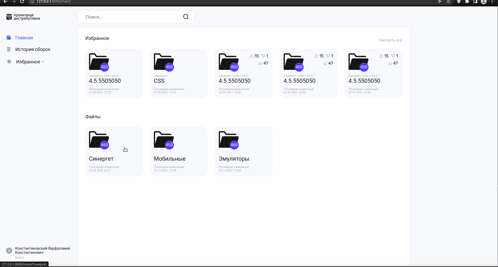

# Distributions Repository

1. [English version](#English-version)
    1. [Instruction](#Instruction)
        1. [Windows](#Windows_EN)
        1. [Linux](#Linux_EN)
2. [Русская версия](#Русская-версия)
    1. [Инструкция](#Инструкция)
        1. [Windows](#Windows_RU)
        1. [Linux](#Linux_RU)

## English version

Web interface for viewing brief statistics, downloading and editing various versions of a single project



Currently 95.6% frontend of main page is made. Now the user can browse through catalogs and use direct links for accessing to catalogs

### Instruction

#### Windows_EN

Later:(

#### Linux_EN

1. Open the catalog in the terminal where you want to place the project
2. Run the following commands:

```bash
git clone https://github.com/Maximum64X/DistributionsRepository
python3 -m venv "address_of_the_project/venv"
source venv/bin/activate
pip install -r requirements.txt
python3 manage.py runserver
```
3. Open the address in the browser http://127.0.0.1:8000

## Русская версия

Веб-интерфейс для просмотра краткой статистики, загрузки и редактирования различых версий одного проекта


На данный момент около 95,6% интерфейса главной страницы готово. Теперь пользователь может путешествовать по каталогам и использовать прямые ссылки для получения доступа к каталогам

### Инструкция

#### Windows_RU

Позже:(

#### Linux_RU

1. Откройте в терминале каталог в котором хотите разместить проект
2. Запустите следующие команды:

```bash
git clone https://github.com/Maximum64X/DistributionsRepository
python3 -m venv "адрес_проекта/venv"
source venv/bin/activate
pip install -r requirements.txt
python3 manage.py runserver
```
3. Откройте в браузере адрес http://127.0.0.1:8000
